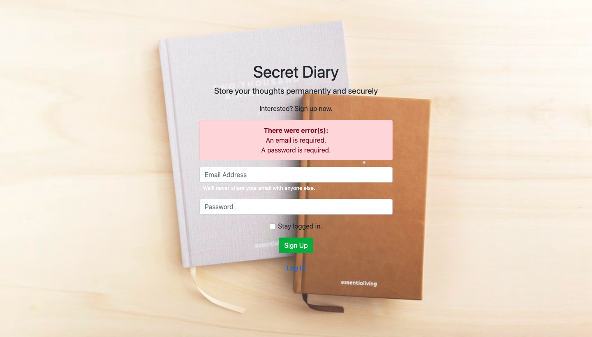
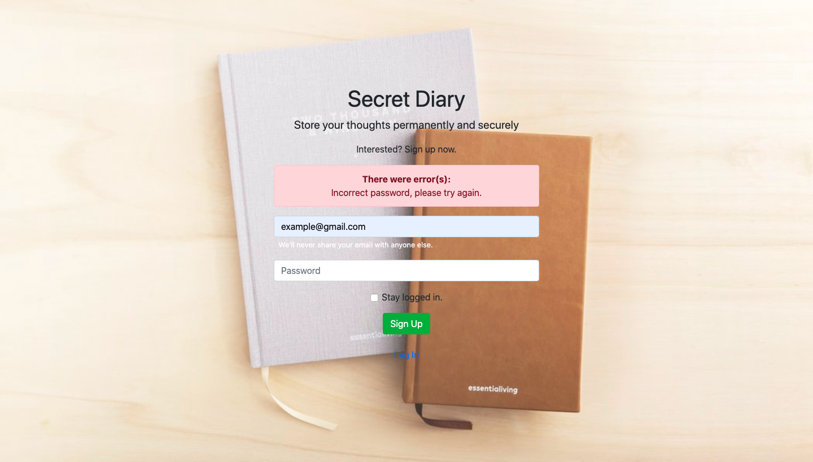
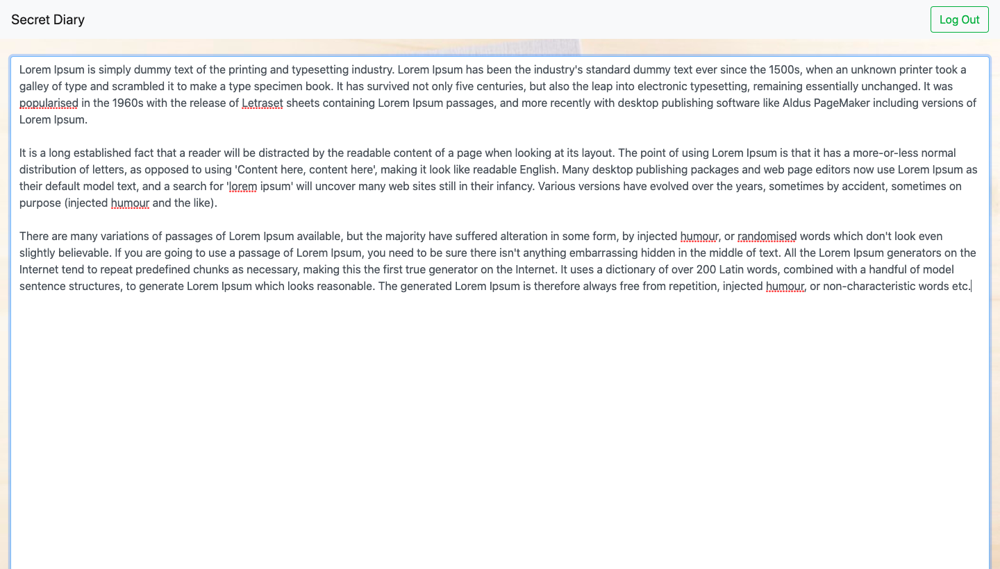

# SecretDiary
This is a webpage in which a user can create an account that allows them to enter their personal thoughts and use as a diary. The diary updates in real time without the user having to worry to press a save button. The user is also kept logged in until they log out; so they can travel to other pages and when they comeback they will be redirected to exactly where they were in their diary.
 
# What I learned
  * Put into practice new php skills
  * PHP POST submissions
  * PHP Sessions
  * PHP/Jquery error handling
  * Learned how to connect to MySql database
  * MySQL queries
  * MySQL password hashing
  * Connect AJAX/PHP/MySQL
  
# Screenshots

